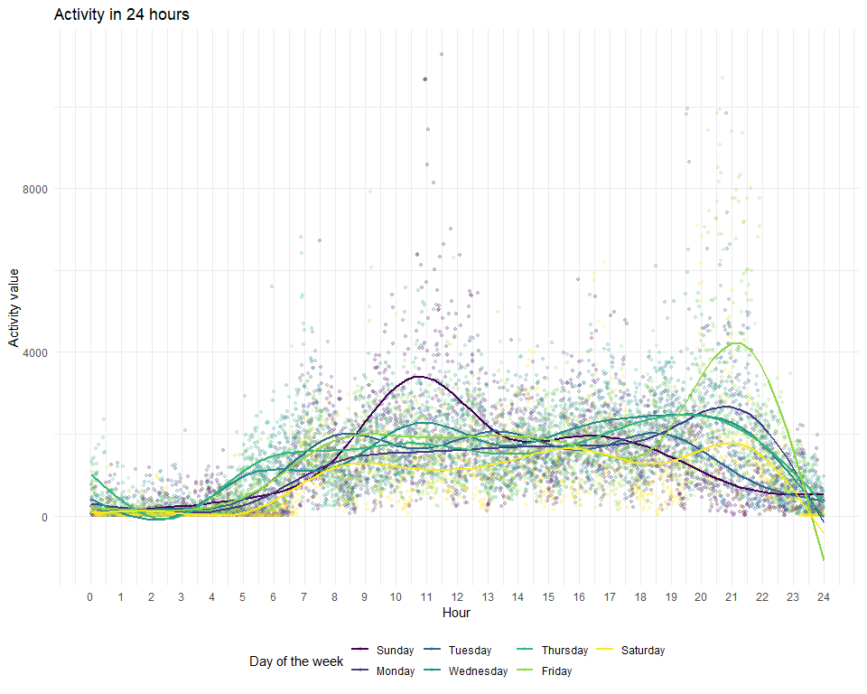

p8105\_hw3\_rw2844
================
Renjie Wei
2020/10/5

  - [Problem 1](#problem-1)
      - [“popular” aisles](#popular-aisles)
      - [aisles with more than 10000
        items](#aisles-with-more-than-10000-items)
      - [popular items in three aisles](#popular-items-in-three-aisles)
      - [Pink Lady Apples and Coffee Ice
        Cream](#pink-lady-apples-and-coffee-ice-cream)
  - [Problem 2](#problem-2)
      - [Clean and describe the data](#clean-and-describe-the-data)
      - [Aggregate accross minutes](#aggregate-accross-minutes)
      - [Make a plot using the data](#make-a-plot-using-the-data)
  - [Problem 3](#problem-3)
      - [Clean the dataset](#clean-the-dataset)
      - [Average max temperature in Jan and
        Jul](#average-max-temperature-in-jan-and-jul)
      - [tmax vs tmin and snowfall by
        year](#tmax-vs-tmin-and-snowfall-by-year)

# Problem 1

Read the instacart data:

``` r
# read the dataset
library(p8105.datasets)
data("instacart")
#check variables types
str(instacart)
```

The`instracart` dataframe has 1384617 observations and 15 variables. The
key variables are:

  - `reordered`: if the customer has ordered this item before. 1 for
    “Yes” and 0 for “No”
  - `order_number`: the number of times of this user to shop here.  
  - `product` and `aisle`: the item customer bought and the aisle of
    that product.  
  - `department`: groups of products.  
  - `order_dow`: the day of the week which the item is ordered (0 for
    “Sunday”, which is confusing).  
  - `order_hour_of_the_day`: the hour of the day which this item is
    ordered.

## “popular” aisles

``` r
#manipulating data
instacart_df = 
  instacart %>% 
  mutate(
    reordered = factor(reordered, labels = c("No","Yes")),
    aisle = as.factor(aisle),
    order_dow = 
      factor(
      order_dow, 
      labels = c("Sunday", "Monday", "Tuesday", "Wednesday", "Thursday", "Friday", "Saturday")
      ),
    department = as.factor(department)
    )
```

Now I’m gonna to find the “top aisles”:

``` r
# top 5 aisles
instacart_df %>%
  count(aisle, name = "n_items_ordered") %>% 
  arrange(desc(n_items_ordered)) %>% 
  head(n = 5) %>% 
  knitr::kable()
```

| aisle                      | n\_items\_ordered |
| :------------------------- | ----------------: |
| fresh vegetables           |            150609 |
| fresh fruits               |            150473 |
| packaged vegetables fruits |             78493 |
| yogurt                     |             55240 |
| packaged cheese            |             41699 |

There are 134 aisles in the store. And the table above shows the top 5
ordered aisles, they are `fresh vegetables`, `fresh fruits`, `packaged
vegetables fruits`, `yogurt` and `packaged cheese`.

## aisles with more than 10000 items

``` r
instacart_df %>% 
  count(aisle, name = "n_items_ordered") %>% 
  # use a filter to find aisles with more than 10000 items ordered.
  arrange(desc(n_items_ordered)) %>% 
  filter(n_items_ordered > 10000) %>% 
  # reorder aisle
  mutate(rank = c(1: length(aisle) ),
         aisle = fct_reorder(aisle, rank))%>%
  ggplot(aes(x = rank, y = n_items_ordered, color = aisle)) + 
  geom_point() +
  labs(
    title = "Aisles with more than 10000 items ordered",
    x = "Rank",
    y = "Items",
    color = "Aisles"
    ) +
  scale_x_continuous(
    breaks = c(seq(1, 40, by = 1)),
    labels = c(seq(1, 40, by = 1))
  ) +
  scale_y_continuous(trans = "sqrt") +
  theme(legend.position = "left") +
  theme(axis.text.x = element_text(angle = 90, vjust = 0.5, hjust = 1))
```


I think a this plot is useful to describe those aisles that has more
than 10,000 items ordered (too much). And a decreasing order may be easy
for us to read.

## popular items in three aisles

``` r
instacart_df %>% 
# pick the three most popular aisles, and focus on the target items.
  filter(aisle %in% c("baking ingredients", "dog food care", "packaged vegetables fruits")) %>% 
  group_by(aisle) %>% 
  count(product_name) %>% 
  mutate(rank = min_rank(desc(n))) %>% 
  filter(rank < 4) %>% 
  arrange(aisle, rank) %>%
  knitr::kable()
```

| aisle                      | product\_name                                 |    n | rank |
| :------------------------- | :-------------------------------------------- | ---: | ---: |
| baking ingredients         | Light Brown Sugar                             |  499 |    1 |
| baking ingredients         | Pure Baking Soda                              |  387 |    2 |
| baking ingredients         | Cane Sugar                                    |  336 |    3 |
| dog food care              | Snack Sticks Chicken & Rice Recipe Dog Treats |   30 |    1 |
| dog food care              | Organix Chicken & Brown Rice Recipe           |   28 |    2 |
| dog food care              | Small Dog Biscuits                            |   26 |    3 |
| packaged vegetables fruits | Organic Baby Spinach                          | 9784 |    1 |
| packaged vegetables fruits | Organic Raspberries                           | 5546 |    2 |
| packaged vegetables fruits | Organic Blueberries                           | 4966 |    3 |

The top three popular products in the specific aisles are shown in the
table above.

## Pink Lady Apples and Coffee Ice Cream

``` r
instacart_df %>%
  # filter two interested products
  filter(product_name %in% c("Pink Lady Apples", "Coffee Ice Cream")) %>% 
  group_by(product_name, order_dow) %>% 
  # summarize the mean hour of the day ordered
  summarize(mean_hour = mean(order_hour_of_day)) %>% 
  pivot_wider(
    names_from = order_dow,
    values_from = mean_hour
  ) %>% 
  knitr::kable(digits = 2)
```

| product\_name    | Sunday | Monday | Tuesday | Wednesday | Thursday | Friday | Saturday |
| :--------------- | -----: | -----: | ------: | --------: | -------: | -----: | -------: |
| Coffee Ice Cream |  13.77 |  14.32 |   15.38 |     15.32 |    15.22 |  12.26 |    13.83 |
| Pink Lady Apples |  13.44 |  11.36 |   11.70 |     14.25 |    11.55 |  12.78 |    11.94 |

The number indicates the mean hour of the day in which is this product
bought(may be better to round it to integer).

# Problem 2

## Clean and describe the data

Read and clean the data.

``` r
# read in and clear the form
acc_df = 
  read.csv("data/accel_data.csv", header = T) %>% 
  janitor::clean_names() %>% 
  # something must be cleaned 
  pivot_longer(
    activity_1:activity_1440,
    names_to = "minute",
    values_to = "activity"
  ) %>%
  separate(minute, into = c("act","minute"),sep = "_") %>%
  mutate(
    week = as.factor(week),
    day = factor(day, levels = c("Sunday", "Monday", "Tuesday", "Wednesday","Thursday", "Friday", "Saturday")),
    day_type = if_else(day %in% c("Saturday", "Sunday"),"weekend","weekday"),
    day_type = as.factor(day_type), 
    minute = as.numeric(minute),
    activity = round(activity) 
    ) %>% 
  select(week,day_id,day,day_type,minute,activity)

acc_df
```

    ## # A tibble: 50,400 x 6
    ##    week  day_id day    day_type minute activity
    ##    <fct>  <int> <fct>  <fct>     <dbl>    <dbl>
    ##  1 1          1 Friday weekday       1       88
    ##  2 1          1 Friday weekday       2       82
    ##  3 1          1 Friday weekday       3       64
    ##  4 1          1 Friday weekday       4       70
    ##  5 1          1 Friday weekday       5       75
    ##  6 1          1 Friday weekday       6       66
    ##  7 1          1 Friday weekday       7       54
    ##  8 1          1 Friday weekday       8       48
    ##  9 1          1 Friday weekday       9       55
    ## 10 1          1 Friday weekday      10       43
    ## # ... with 50,390 more rows

The `acc_df` has 50400 rows and 6 of variables. Variables are week,
day\_id, day, day\_type, minute, activity:

`week`:the week of the observation, from 1 to 5.

`day_id`: the id of the day of the observation, from 1 to 35

`day`:the name of the day of the week, from Sunday to Saturday

`day_type`: indicate the status of weekday/weekend.

`activity`: indicates the subject’s activity status at that minute.

`minute`: the exact minute of the day of observation, from 1 to 1440.

## Aggregate accross minutes

Now I’m going to make a table showing the aggregated activity counts:

``` r
acc_df %>% 
  group_by(week,day) %>% 
  summarize(day_activity_sum = sum(activity)) %>%
  pivot_wider(
    id_cols = "week",
    names_from = "day",
    values_from = "day_activity_sum"
  ) %>% 
  knitr::kable()
```

| week | Sunday | Monday | Tuesday | Wednesday | Thursday | Friday | Saturday |
| :--- | -----: | -----: | ------: | --------: | -------: | -----: | -------: |
| 1    | 631105 |  78830 |  307103 |    340113 |   355948 | 480534 |   376254 |
| 2    | 422018 | 295431 |  423245 |    440962 |   474048 | 568839 |   607175 |
| 3    | 467052 | 685910 |  381507 |    468869 |   371230 | 467420 |   382928 |
| 4    | 260617 | 409450 |  319568 |    434460 |   340291 | 154049 |     1440 |
| 5    | 138421 | 389080 |  367824 |    445366 |   549658 | 620860 |     1440 |

There is a increasing activity minutes from Monday to Friday in the
first three weeks. And a decrease of activity time from Friday to
Saturday. However, from week 4 to week 5, the activity counts drop from
weekday to weekend become much bigger.

## Make a plot using the data

Plot showing the 24-hour activity time courses for each day:

``` r
acc_df %>%
  group_by(day, minute) %>% 
  summarize(activity_sum = sum(activity)) %>% 
  ggplot(aes(x = minute ,y = activity_sum, color = day)) +
  geom_point(alpha = .2, size = 1) +
  # for a better and more simple plot, I choose to hide the CI
  stat_smooth(se = FALSE) +
  labs(
    title = "Activity in 24 hours",
    x = "Hour",
    y = "Activity value",
    color = "Day of the week"
    ) +
  scale_x_continuous(
    breaks = c(seq(0, 1440, by = 60)),
    labels = c(seq(0, 24, by = 1))
  )
```


We can found that there are 2 peaks in the plot above, one is on Sunday
Morning and the other one is on Friday Night. And he goes to bed on 23PM
and wakes up at 5AM since the activity counts during this period is very
low.

# Problem 3

Load the `ny_noaa` dataset:

``` r
library(p8105.datasets)
data("ny_noaa")
str(ny_noaa)
```

    ## tibble [2,595,176 x 7] (S3: tbl_df/tbl/data.frame)
    ##  $ id  : chr [1:2595176] "US1NYAB0001" "US1NYAB0001" "US1NYAB0001" "US1NYAB0001" ...
    ##  $ date: Date[1:2595176], format: "2007-11-01" "2007-11-02" ...
    ##  $ prcp: int [1:2595176] NA NA NA NA NA NA NA NA NA NA ...
    ##  $ snow: int [1:2595176] NA NA NA NA NA NA NA NA NA NA ...
    ##  $ snwd: int [1:2595176] NA NA NA NA NA NA NA NA NA NA ...
    ##  $ tmax: chr [1:2595176] NA NA NA NA ...
    ##  $ tmin: chr [1:2595176] NA NA NA NA ...
    ##  - attr(*, "spec")=
    ##   .. cols(
    ##   ..   id = col_character(),
    ##   ..   date = col_date(format = ""),
    ##   ..   prcp = col_integer(),
    ##   ..   snow = col_integer(),
    ##   ..   snwd = col_integer(),
    ##   ..   tmax = col_character(),
    ##   ..   tmin = col_character()
    ##   .. )

``` r
# EXTENSIVE MISSING DATA
```

The`ny_noaa` dataframe has 2595176 observations and 7 variables. The key
variables are:

  - `date`: Date of observation.  
  - `prcp`: Precipitation(tenths of mm).  
  - `snow`: Snowfall(mm).  
  - `snwd`: Snow depth(mm).  
  - `tmax` and `tmin`: Maximum and minimum temperature(tenths of degree
    Celsius).

Since each weather station may collect only a subset of these variables,
the resulting dataset contains extensive missing data. There is total
3387623 missing values.

## Clean the dataset

``` r
weather_df = 
  ny_noaa %>% 
  separate(date, into = c("year","month","day"),sep = "-") %>% 
  mutate(
    year = as.factor(year),
    month = as.integer(month),
    month = (month.name[month]),
    day = as.factor(day),
    prcp = prcp / 10,
    tmax = as.numeric(tmax),
    tmin = as.numeric(tmin),
    tmax = tmax / 10,
    tmin = tmin / 10
  ) 
#make a table shows the most common observations of snowfall
weather_df %>% 
  count(snow, name = "n_of_observations") %>% 
  drop_na(snow) %>% 
  arrange(desc(n_of_observations)) %>% 
  head(n = 5) %>% 
  knitr::kable()
```

| snow | n\_of\_observations |
| ---: | ------------------: |
|    0 |             2008508 |
|   25 |               31022 |
|   13 |               23095 |
|   51 |               18274 |
|   76 |               10173 |

The most observed values are `0`(2008508 observations) , `25`(31002
observations) and `13`(23095 observations), that means there are few
snowy days in New York.

## Average max temperature in Jan and Jul

``` r
weather_df %>%
  #focus on Jan and Jul
  filter(month %in% c("January", "July")) %>% 
  group_by(year, month, id) %>% 
  summarise(mean_of_tmax = mean(tmax,na.rm = TRUE)) %>% 
  ggplot(aes(x = year ,y = mean_of_tmax)) + 
  geom_boxplot(aes(fill = year)) +
  facet_grid(.~month) +
  labs(
    title = "Mean max temperature in New York, Janurary and July",
    x = "Year",
    y = "Mean Temperature(℃)",
    caption = "data from NOAA National Climatic Data Center"
  ) +
  theme(legend.position = "none")+
  theme(axis.text.x = element_text(angle = 90, vjust = 0.5, hjust = 1))
```


The average temperature in January is lower than the average temperature
in July. That makes sense since New York is in Winter during January and
Summer during July. The outliers are shown as the dots in the boxplots.

## tmax vs tmin and snowfall by year

``` r
tmax_tmin =
  weather_df %>%
  ggplot(aes(x = tmax, y = tmin)) +
  geom_bin2d() +
    labs(
    title = "Max vs Min Temperature",
    x = "Max temperature (℃)",
    y = "Min temperature (℃)",
    caption = "data from NOAA National Climatic Data Center"
  ) +
  theme(legend.position = "left")

snow_fall =
  weather_df %>%
  filter(between(snow,1,100), !is.na(snow)) %>%
  ggplot(aes(x = snow)) +
  geom_density_ridges(aes(y = year,
                          group = as.factor(year)),
                          alpha = 0.1,
                      rel_min_height = 0.1) +
    labs(
    title = "Snowfall between 0 to 100",
    x = "Time (year)",
    y = "Snowfall (mm)",
    caption = "data from NOAA National Climatic Data Center"
  ) +
  theme(legend.position = "none") +
  theme(axis.text.x = element_text(angle = 90, vjust = 0.5, hjust = 1))


tmax_tmin / snow_fall
```


I think the `bin2d` is useful to show the correlation between max and
min temperatures.
